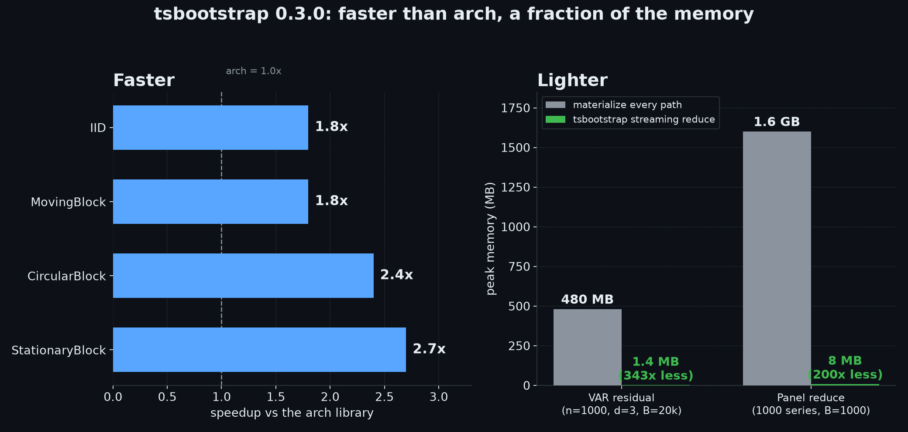

<!-- mcp-name: io.github.astrogilda/tsbootstrap -->

<!-- ALL-CONTRIBUTORS-BADGE:START - Do not remove or modify this section -->
[](#contributors)
<!-- ALL-CONTRIBUTORS-BADGE:END -->


<div align="center">
    <div style="float: left; margin-right: 20px;">
        
    </div>
    <h3>Generate bootstrapped samples from time-series data. The full documentation is available <a href="https://tsbootstrap.readthedocs.io/en/latest/">here</a>.</h3>
    <div style="clear: both;"></div>
    <br>
    <p align="center">
        
        
        
        
    </p>
    <a href="https://arxiv.org/abs/2404.15227">
    </a>
    <a href="https://pypi.org/project/tsbootstrap/">
        
    </a>
    <a href="https://pypi.org/project/tsbootstrap/">
        
    </a>
    <a href="https://pepy.tech/project/tsbootstrap">
        
    </a>
    
    
    <a href="https://codecov.io/gh/astrogilda/tsbootstrap"></a>
    <a href="https://doi.org/10.5281/zenodo.8226495"></a>
    <a href="https://mybinder.org/v2/gh/astrogilda/tsbootstrap/HEAD?labpath=docs/source/tutorials/quickstart.ipynb"></a>
    
    
    
    
    <a href="https://deepwiki.com/astrogilda/tsbootstrap"></a>
    <a href="https://context7.com/astrogilda/tsbootstrap"></a>
</div>


## 📒 Table of Contents

1. [🚀 Getting Started](#-getting-started)
2. [⚡ Performance](#-performance)
3. [🧩 Modules](#-modules)
4. [🗺 Roadmap](#-roadmap)
5. [🤝 Contributing](#-contributing)
6. [📄 License](#-license)
7. [📍 Time Series Bootstrapping Methods intro](#time-series-bootstrapping)
8. [👏 Contributors](#-contributors)


---

## 🚀 Getting Started

### 🎮 Using tsbootstrap

`tsbootstrap` exposes one typed entry point, `bootstrap`, configured with a method
specification. The same call works for every method.

```python
import numpy as np
from tsbootstrap import bootstrap, MovingBlock

x = np.random.default_rng(0).standard_normal(200)

result = bootstrap(x, method=MovingBlock(block_length="auto"), n_bootstraps=999, random_state=0)

samples = result.values()      # (n_bootstraps, n) resampled series
oob = result.get_oob_mask()    # (n_bootstraps, n) out-of-bag mask
```

Choose a method spec for the structure you need (block lengths default to the
automatic Politis-White selection):

```python
from tsbootstrap import StationaryBlock, ResidualBootstrap, SieveAR, AR, ARIMA, diagnose

bootstrap(x, method=StationaryBlock(avg_block_length="auto"))

# recursive model-based bootstraps (need the model extra: uv add "tsbootstrap[models]")
bootstrap(x, method=ResidualBootstrap(model=AR(order=2)))
bootstrap(x, method=ResidualBootstrap(model=ARIMA(order=(1, 1, 1))))
bootstrap(x, method=SieveAR())

# not sure which fits? ask:
print(diagnose(x).recommended_methods)
```

Inputs can be NumPy arrays, lists, or pandas / Polars DataFrames and Series. The
result is a `BootstrapResult` carrying the samples, provenance metadata, and
out-of-bag / in-bag primitives. For the sktime ecosystem, the same methods are
also available as estimator classes (`MovingBlockBootstrap`, `ARResidualBootstrap`,
`SieveBootstrap`, and the rest) under `tsbootstrap.adapters`.

### Uncertainty quantification

The `uq` layer turns resampled series into prediction intervals. `forecast_intervals`
gives forward forecast bands for an AR model; `EnbPIEnsemble` produces out-of-bag
prediction intervals for an sklearn-style regressor, with calibrators for stationary,
volatility-clustered, and drifting data (static, sliding window, and the adaptive ACI
and NexCP schemes); and `bootstrap_reduce` streams a per-replicate statistic so
calibration scales to large replicate counts without holding every path in memory.

```python
from tsbootstrap import AR, forecast_intervals

lower, upper, median = forecast_intervals(x, model=AR(order=2), horizon=12, alpha=0.1)
```

The conformal pieces (`EnbPIEnsemble` and the calibrators) need the `uq` extra
(scikit-learn). The interactive
[tutorial gallery](https://tsbootstrap.readthedocs.io/en/latest/tutorials/index.html)
works through every method on real and synthetic data, including a "which bootstrap
should I use?" decision guide.

### MCP server

`tsbootstrap` ships a read-only [Model Context Protocol](https://modelcontextprotocol.io)
server so an MCP client (an LLM agent, an IDE) can diagnose a short series and compute a
bootstrap confidence interval without writing any Python. Run it with no install step:

```sh
uvx --from "tsbootstrap[mcp]" tsbootstrap-mcp
```

It speaks the stdio transport and exposes exactly two read-only tools:

- `diagnose_series`: serial-dependence and stationarity diagnostics, a recommended
  Politis-White block length, and the bootstrap methods the server supports for the series.
- `bootstrap_confidence_interval`: a percentile confidence interval for the mean, median,
  std, or variance, using an i.i.d. or block bootstrap.

Both tools accept at most 500 observations and run at most 500 replicates. For larger
series, model-based methods, or the uncertainty layer, use the library directly in a
local script.

### 📦 Installation

Requires Python 3.10 or higher.

```sh
# with uv (recommended):
uv add tsbootstrap                   # core: i.i.d. and block methods
uv add "tsbootstrap[models]"         # adds AR / ARIMA / VAR / sieve (statsmodels)

# with pip:
pip install tsbootstrap
pip install "tsbootstrap[models]"
```

The model-based methods import statsmodels lazily and raise a clear install hint if
the `models` extra is missing.

## ⚡ Performance



*Left: speedup of the compiled reduce path over the arch library on the four overlapping methods. Right: peak memory before and after on the two headline reduce workloads (baseline = materialize every path, then reduce). Regenerate with `python benchmarks/plot_launch.py`.*

tsbootstrap ships an optional compiled backend (`backend="compiled"`, via the
`[accel]` extra) that is faster than the [`arch`](https://github.com/bashtage/arch)
library on every overlapping resampling method. The table below is the speedup of
the streaming reduce path over `arch.apply` on an 8-core CPU (higher is better).

| Method | n=200, B=999 | n=200, B=10000 | n=2000, B=999 | n=2000, B=10000 |
|-----------------|--------------|----------------|---------------|-----------------|
| IID | 1.3x | 1.3x | 1.8x | 1.8x |
| MovingBlock | 1.6x | 1.6x | 1.9x | 1.8x |
| CircularBlock | 1.7x | 1.7x | 2.4x | 2.4x |
| StationaryBlock | 1.6x | 1.6x | 2.5x | 2.7x |

The compiled reduce fuses index build, gather, and reduction into one pass, so
peak memory stays flat in the number of replicates: a multivariate VAR residual
bootstrap that would materialize a 480 MB tensor needs about 1.4 MB, and a
1000-series panel uses about 8 MB instead of 1.6 GB. The multivariate and
ragged-panel reduce paths have no equivalent in `arch`. Full methodology,
single-threaded numbers, and the reproduction script are in
[benchmarks/README.md](benchmarks/README.md).

```sh
# install the compiled backend
uv add "tsbootstrap[accel]"
# or
pip install "tsbootstrap[accel]"
```

## 🧩 Modules

Package layout:

| Area | Module(s) | Role |
| --- | --- | --- |
| Public API | `api.py`, `methods.py`, `results.py`, `errors.py`, `diagnostics.py` | the `bootstrap()` entry point, typed method specs, structured results, error taxonomy, and `diagnose()` |
| Infrastructure | `rng.py`, `validation.py`, `dispatch.py`, `metadata.py` | deterministic RNG contract, input coercion (incl. the narwhals DataFrame boundary), spec to executor dispatch, method metadata |
| Block methods | `block/` | vectorized index kernels, true Politis-Romano stationary, energy-normalized tapering, PWSD block length, OOB primitives |
| Model methods | `model/`, `engines/` | model fitting, stability guards, and recursive AR/ARMA/VAR simulation |
| Uncertainty quantification | `uq/` | EnbPI prediction intervals, the static / sliding-window / ACI / NexCP calibrators, and AR forecast intervals |
| Ecosystem | `adapters/` | skbase / sktime estimator classes over the functional core |


## 🗺 Roadmap

The full, living roadmap is [issue #181](https://github.com/astrogilda/tsbootstrap/issues/181). Highlights:

Near term (v0.2.x):
- Out-of-sample forecast intervals for ARIMA and VAR (v0.2.0 ships AR-only).
- The tutorial gallery and getting-started notebook ([#46](https://github.com/astrogilda/tsbootstrap/issues/46)).
- Python 3.14, once statsmodels publishes a 3.14 wheel ([#202](https://github.com/astrogilda/tsbootstrap/issues/202)).

Candidate methods (good first issues):
- Generalized block ([#104](https://github.com/astrogilda/tsbootstrap/issues/104)), local block ([#105](https://github.com/astrogilda/tsbootstrap/issues/105)), and frequency-domain ([#107](https://github.com/astrogilda/tsbootstrap/issues/107)) bootstraps.
- Wild and dependent-wild bootstraps, and a GARCH / volatility residual bootstrap.

Distributed execution (`Dask` / `Spark` / `Ray`), an async layer, and a string-keyed
factory were considered and deliberately left out. The library is a CPU-bound,
single-process toolkit.

## 🤝 Contributing

See our [good first issues ](https://github.com/astrogilda/tsbootstrap/issues?q=is%3Aissue+is%3Aopen+label%3A%22good+first+issue%22)
for getting started.

### Developer setup

1. Fork the tsbootstrap repository

2. Clone the fork to local:
```sh
git clone https://github.com/astrogilda/tsbootstrap
```

3. In the local repository root, sync the locked development environment with uv:
```sh
uv sync --extra dev
```

4. uv creates an isolated virtual environment from `uv.lock` and editable-installs the
package, so changes to the package are reflected in your environment automatically. Run
tools through the environment with `uv run` (for example `uv run pytest`).

5. Install the pre-commit hooks:
```sh
uv run pre-commit install
```

The hooks run ruff, formatting, and the other code-quality checks on each commit.

### Verifying the Installation

Verify the installation:
```
python -c "import tsbootstrap; print(tsbootstrap.__version__)"
```

This prints the installed version.

### Contribution workflow

1. Create a new branch with a descriptive name (e.g., `new-feature-branch` or `bugfix-issue-123`).
```sh
git checkout -b new-feature-branch
```
2. Make changes to the project's codebase.
3. Commit your changes to your local branch with a clear commit message that explains the changes you've made.
```sh
git commit -m 'Implemented new feature.'
```
4. Push your changes to your forked repository on GitHub using the following command
```sh
git push origin new-feature-branch
```
5. Create a new pull request to the original project repository. In the pull request, describe the changes you've made and why they're necessary.

### 🧪 Running Tests

To run all tests, in your developer environment, run:

```sh
uv run pytest tests/
```

The sktime adapter classes can be validated with sktime's estimator checks:

```python
from sktime.utils import check_estimator
from tsbootstrap.adapters import MovingBlockBootstrap

check_estimator(MovingBlockBootstrap)
```

### Contribution guide

See [CONTRIBUTING.md](https://github.com/astrogilda/tsbootstrap/blob/main/CONTRIBUTING.md) for details.
---

## 📄 License

This project is licensed under the `ℹ️  MIT` License. See the [LICENSE](https://docs.github.com/en/communities/setting-up-your-project-for-healthy-contributions/adding-a-license-to-a-repository) file for additional info.

---
## 👏 Contributors

Contributors:

<!-- ALL-CONTRIBUTORS-LIST:START - Do not remove or modify this section -->
<!-- prettier-ignore-start -->
<!-- markdownlint-disable -->

<!-- markdownlint-restore -->
<!-- prettier-ignore-end -->

<!-- ALL-CONTRIBUTORS-LIST:END -->

This project follows the [all-contributors](https://github.com/all-contributors/all-contributors) specification. Contributions of any kind welcome!


---


## 📍 Time Series Bootstrapping
`tsbootstrap` implements bootstrapping methods for time series data. It generates resampled copies of univariate and multivariate series that preserve their chronological order and dependence structure.

### Overview
Traditional bootstrap methods resample observations independently, which breaks the dependence in a time series: each observation usually depends on the ones before it. Time series bootstraps resample while preserving chronological order and correlation, so the resulting uncertainty estimates stay valid under that dependence.

### Bootstrapping methodology
`tsbootstrap` resamples either the observations directly (i.i.d. and block methods) or
the innovations of a fitted model (residual and sieve methods), respecting the
chronological order and dependence structure of the data.

### Block bootstrap
Block methods resample blocks of consecutive observations to preserve short-range
dependence. The block length defaults to the automatic Politis-White (2004) selection.

- **Moving block** (`MovingBlock`): overlapping fixed-length blocks (Kunsch 1989).
- **Circular block** (`CircularBlock`): blocks wrap around the series end (Politis-Romano 1992).
- **Stationary block** (`StationaryBlock`): geometric block lengths with independent uniform
  restart points (Politis-Romano 1994).
- **Non-overlapping block** (`NonOverlappingBlock`): disjoint blocks (Carlstein 1986).
- **Tapered block** (`TaperedBlock(window=...)`): blocks weighted by an energy-normalized
  window (Bartlett, Blackman, Hamming, Hann, or Tukey; Paparoditis-Politis 2001).

### Residual bootstrap
For dependent data with a good model fit, `ResidualBootstrap(model=...)` regenerates the
series **recursively** from the fitted dynamics and resampled, centered innovations (not
`fitted + residuals`). Supported models: `AR`, `ARIMA`, and `VAR` (multivariate). A
non-stationary fit is refused (or skipped, per `stability_policy`) rather than producing
explosive paths.

### Sieve bootstrap
`SieveAR` selects an autoregressive order on the original series, then runs the AR recursion;
suited to data with autoregressive structure.

### Deferred to a later release
Markov resampling, the distribution bootstrap, GARCH/volatility models, and
frequency-domain / seasonal block methods are planned for a future version. The
statistic-preserving method has been removed.
